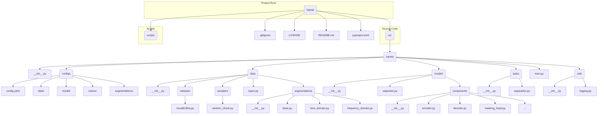

# Banda: Source Separation ML Package

This project aims to develop a robust and scalable machine learning package for source separation, leveraging PyTorch with PyTorch Lightning, Hydra for configuration, Ray for distributed computing, and Pydantic for strict data typing. The design emphasizes modularity, decoupling of components, and adherence to industry best practices, drawing inspiration from projects like Hugging Face while avoiding their audio-specific pitfalls.

## Dual Licensing

This project is dual-licensed. It is available under the following licenses:

GNU Affero General Public License v3.0 for Academic & Non-Commercial Research Use.
Commercial License for commercial use. Contact Karn Watcharasupat (kwatcharasupat@ieee.org) to obtain a commercial license.

## Project Structure

The proposed directory structure is designed for scalability, clear separation of concerns, and adherence to modern Python packaging standards.



## Core Component Design

### Licensing
The existing `LICENSE` file will be updated with the dual-license text provided.

### Dependencies (`pyproject.toml`)
All project dependencies will be defined here, including `torch`, `pytorch-lightning`, `hydra-core`, `ray`, `pydantic`, `torchaudio`, `numpy`, and `structlog`.

### Configuration (`src/banda/configs`)
Hydra configurations will be organized by function (data, model, trainer, augmentations) and composed in the main `config.yaml`. This allows for flexible and extensible configuration management.

### Data Types (`src/banda/data/types.py`)
Pydantic models will be used for defining all data structures, ensuring type safety and clear data contracts. This includes `TorchInputAudioDict`, `NumPyInputAudioDict`, `Identifier`, and dataset-specific identifiers (e.g., `MUSDB18HQIdentifier`).

### Decoupled Data Handling (`src/banda/data`)
*   **`src/banda/data/datasets/base.py`**: This file will define an abstract base class `SourceSeparationDataset`, handling common logic for audio loading, resampling, and applying pre-mix and post-mix transformations.
*   **`src/banda/data/datasets/musdb18hq.py`**: This will implement the `MUSDB18HQDataset`, inheriting from `SourceSeparationDataset`. It will use a dedicated connector for MUSDB18HQ-specific data loading and preprocessing (e.g., parsing track IDs, handling file paths). Dataset-specific preprocessing will be encapsulated within each dataset class.
*   **`src/banda/data/samplers/random_chunk.py`**: This will implement a `PreMixTransform` for random chunking, allowing for flexible data sampling strategies.

### Composable Augmentations (`src/banda/data/augmentations`)
This module will provide a flexible and configurable system for data augmentation.
*   **`src/banda/data/augmentations/base.py`**: Will define `PreMixTransform` and `PostMixTransform` abstract base classes, along with `ComposePreMixTransforms` and `ComposePostMixTransforms` for chaining multiple transformations.
*   **`src/banda/data/augmentations/time_domain.py` and `src/banda/data/augmentations/frequency_domain.py`**: These files will contain concrete augmentation implementations (e.g., pitch shift, noise addition) as subclasses of `PreMixTransform` or `PostMixTransform`.
*   **Application Stages**: Augmentations will be applied at various stages as required:
    *   **Before chunking**: Handled by the dataset's initial loading or a `PreMixTransform` applied before chunking.
    *   **After chunking**: If chunking is a `PreMixTransform`, subsequent `PreMixTransform`s will apply after chunking.
    *   **Before mixing at stem level**: `PreMixTransform`s applied to individual stems before they are mixed.
    *   **After mixing**: `PostMixTransform`s applied to the `TorchInputAudioDict` after the mixture is formed.

### Models (`src/banda/models`)
The model structure will emphasize modularity and reusability to avoid complexity.
*   **`src/banda/models/separator.py`**: This will be the main `nn.Module` for the source separation task. It will orchestrate the flow from input mixture to separated sources by composing smaller, well-defined modules.
*   **`src/banda/models/components/`**: A new directory for modular, reusable model building blocks (e.g., `encoder.py`, `decoder.py`, `masking_head.py`, `rnn_block.py`, `transformer_block.py`). This approach ensures a clean and maintainable model structure.

### Lightning Tasks (`src/banda/tasks`)
The `LightningModule` will be defined here, connecting the data, models, and training logic in a structured manner.

### Training Entrypoint (`src/banda/train.py`)
A single, clean entry point that uses Hydra to configure and run the training process.

### Logging (`src/banda/utils/logging.py`)
Structured logging will be set up using `structlog` for better observability and debugging.

### Documentation
All files will be created with placeholder docstrings in the PyTorch style, including shape and type annotations, to ensure clear and consistent documentation.

## Preprocessing MUSDB18HQ Dataset

To convert the raw MUSDB18HQ dataset (or a sample of it) into the `.npz` format required by the data loaders, use the provided preprocessing script.

1.  **Install Dependencies**: Ensure you have `soundfile` installed (it's included in `pyproject.toml` and `environment.yaml`).
2.  **Set `DATA_ROOT`**: Make sure your `DATA_ROOT` environment variable points to the parent directory where your raw `musdb18-sample` (or full `musdb18hq`) dataset is located. For example:
    ```bash
    export DATA_ROOT="~/personal/data"
    ```
    And your raw dataset should be at `~/personal/data/musdb18-sample` (or `~/personal/data/musdb18hq`).
3.  **Run Preprocessing Script**:
    ```bash
    python scripts/preprocess_musdb18.py
    ```
    You can override configuration parameters using Hydra. For example, to specify the input and output paths:
    ```bash
    python scripts/preprocess_musdb18.py input_path="${DATA_ROOT}/musdb18hq" output_path="${DATA_ROOT}/musdb18hq/intermediates/npz"
    ```
    Or to process only specific stems:
    ```bash
    python scripts/preprocess_musdb18.py stems_to_process='["vocals", "mixture"]'
    ```
    The processed `.npz` files will be saved to the `output_path` specified in the configuration (defaulting to `"${DATA_ROOT}/musdb18-sample/intermediates/npz"` for the sample dataset).